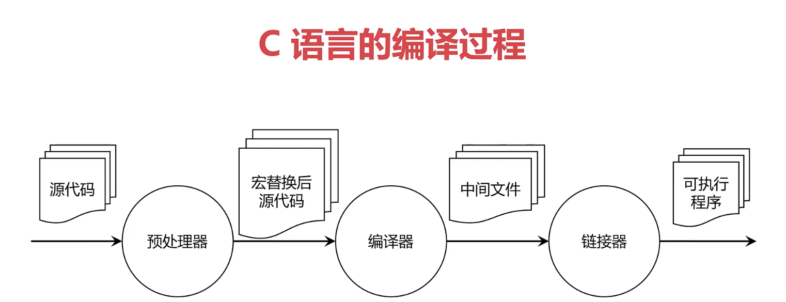

## 可执行程序的编译过程



### 使用 gcc 手动编译
```c
// 1.预编译
gcc -E helloworld.c -o helloworld.i

// 2.预编译文件 -> 汇编
gcc -S helloworld.i -o helloworld.s

// 3.汇编 -> 目标文件
gcc -c helloworld.s -o helloworld.o

// 4. 链接 -> 可执行程序(hello); 要查看过程，则加 -v 参数
gcc helloworld.o -o hello
```